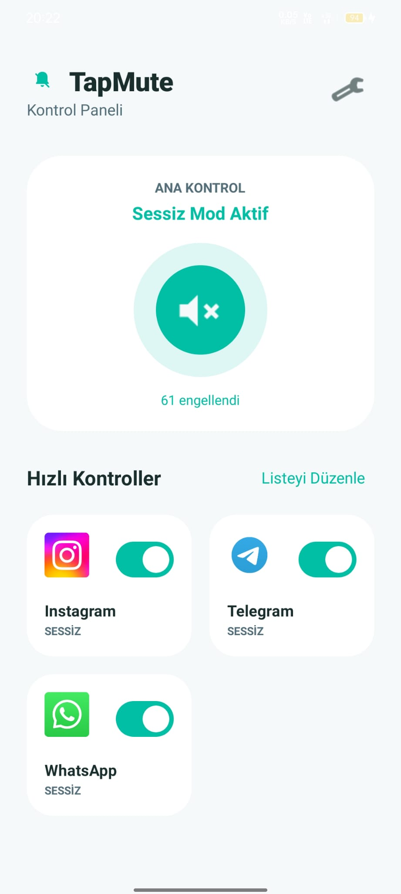
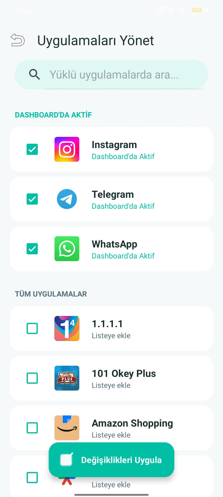
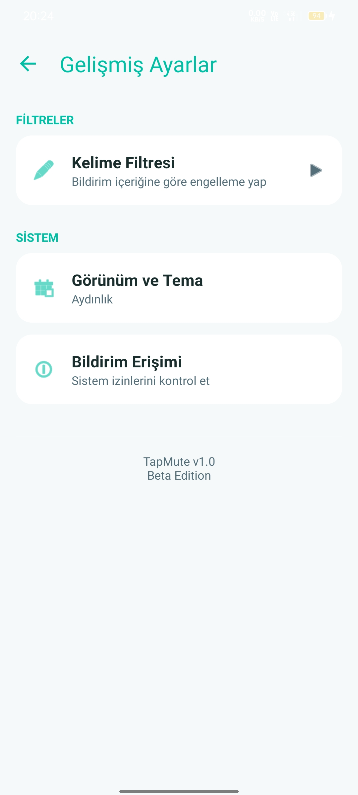
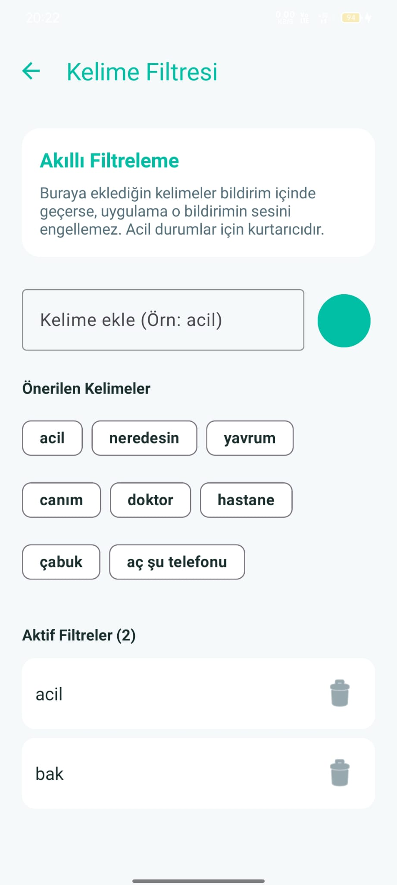
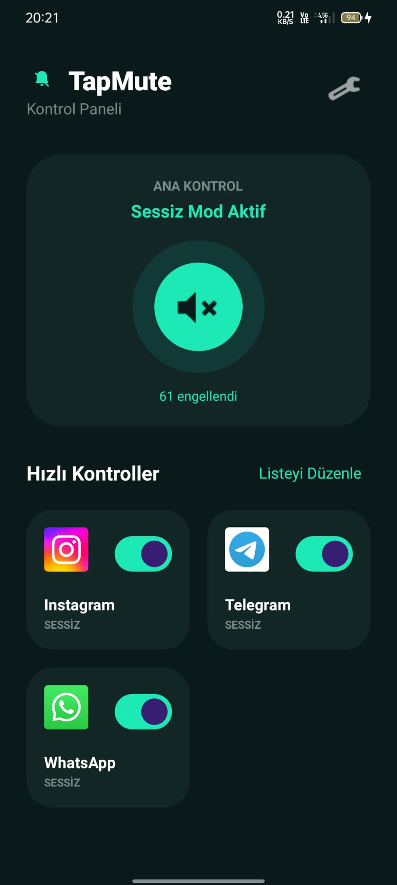
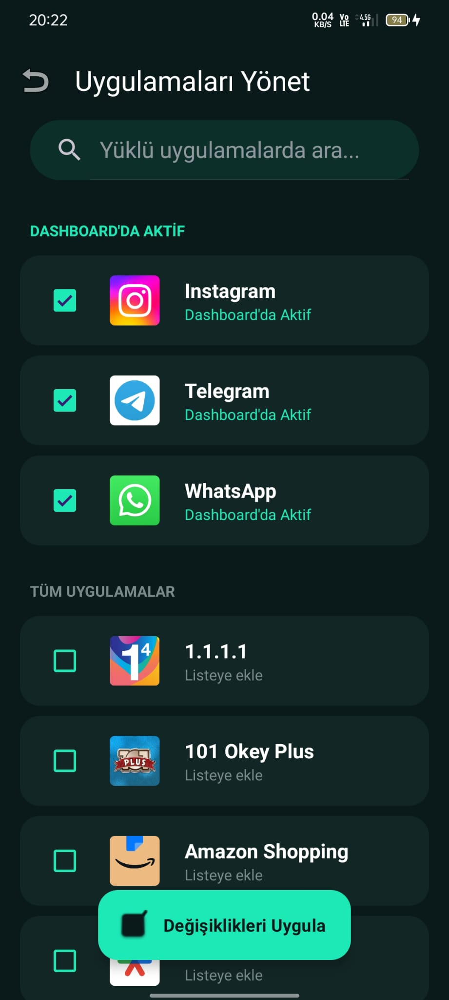
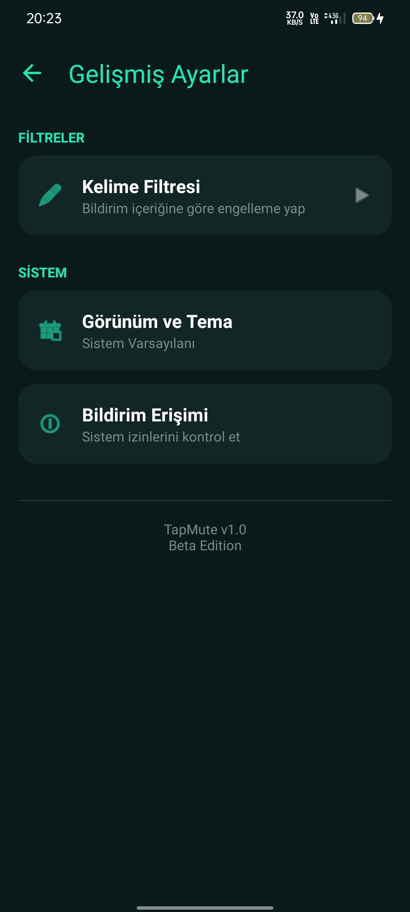
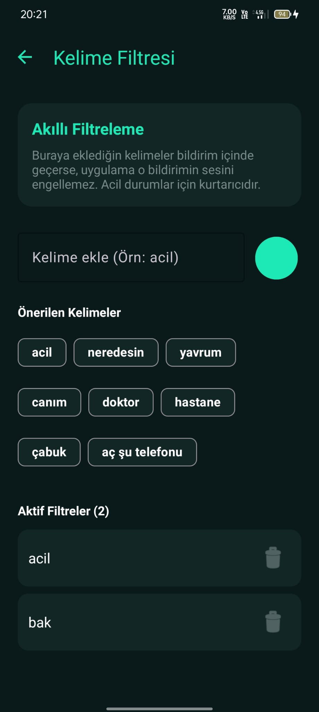

# 🔇 TapMute

[](LICENSE)


> **Focus on what matters.** Tek bir dokunuşla gürültüyü kesin, kontrolü elinize alın.

TapMute, Android cihazınızdaki uygulama bildirimlerini (WhatsApp, Instagram, Telegram vb.) anında ve tamamen sessize almanızı sağlayan, minimalist ve şık bir yardımcı araçtır. En önemli özelliği ise **telefon aramalarını asla engellememesidir.**

---

## 🌟 Neden TapMute?

Gün boyu gelen yüzlerce bildirim odaklanmamızı zorlaştırıyor. Rahatsız Etmeyin (Do Not Disturb) modu bazen çok katı kalabiliyor. TapMute ile:
- Sadece seçtiğiniz "gürültülü" uygulamaları susturursunuz.
- Beklediğiniz o önemli telefon araması her zaman size ulaşır.
- Karmaşık ayarlarla uğraşmaz, tek tıkla huzura kavuşursunuz.

---

## 🔥 Temel Özellikler

- **🎨 Neon Teal Tasarım:** Modern ve premium bir arayüz.
- **🔇 Akıllı Sessiz Mod:** Aramaları engellemeden uygulamaları susturma.
- **🔍 Akıllı Kelime Filtresi:** "Acil", "Hastanede" gibi belirlediğiniz kritik kelimeleri içeren bildirimlerin sessiz modda bile size ulaşmasını sağlayın.
- **⚡ Hızlı Erişim:** Ana ekran widget desteği.
- **🔔 Uygulama İkonu:** Yeni minimalist tasarım.
- **⚡ Quick-Access Widget:** Uygulamayı açmadan ana ekranınızdan kontrol edin.
- **🎨 Modern Aesthetic:** Neon Teal detaylı, göz yormayan Premium Karanlık veya Aydınlık Tema.
- **🔒 Gizlilik:** Verileriniz cihazınızda kalır, bildirim içerikleri okunmaz.

---

## 📸 Ekran Görüntüleri

<p align="center">
  
  
  
  
</p>
<p align="center">
  
  
  
  
</p>

---

## 🚀 Hızlı Başlangıç

1. **İzin Ver:** Uygulamayı açın ve `Bildirim Erişimi` iznini onaylayın.
2. **Seç:** "Listeyi Düzenle" üzerinden susturmak istediğiniz uygulamaları (örn. WhatsApp) işaretleyin.
3. **Başlat:** Ana ekrandaki büyük butona veya Widget'a dokunarak sessiz modu aktif edin.

---

## 🛠️ Teknik Kurulum

Geliştiriciler için derleme adımları:

```bash
# Projeyi klonlayın
git clone https://github.com/yusufgul/tap-mute.git

# APK derleyin
./gradlew assembleDebug
```

**Gereksinimler:** Android 8.0+ (Oreo)

---

## 🤝 Katkıda Bulun ve Lisans

Bu proje **Özel (Proprietary) Lisans** ile korunmaktadır. Projeyi kopyalamak veya izinsiz dağıtmak yasaktır, ancak geliştirmeme yardımcı olabilirsiniz:

- **Hata Bildirimi:** Herhangi bir sorun bulursanız `Issue` açabilirsiniz.
- **Pull Request:** Yeni özellikler eklemek isterseniz PR gönderebilirsiniz. Onaylanan katkılar projeye dahil edilir.
- **İletişim:** Geliştirme süreci veya izinler için benimle iletişime geçebilirsiniz.

Detaylı bilgi için [LICENSE](LICENSE) dosyasına göz atabilirsiniz.

---

Eğer kurulum işlemini tamamlayamazsanız benimle iletişime geçebilirsiniz ya da beni takip edebilirsiniz :)

[](https://youtube.com/@aientitiylab)
[](https://twitter.com/yuusufgul)
[](https://linkedin.com/in/yusufgul)
[](https://instagram.com/yyusufgull)
[](https://github.com/yuusufgul16)

---
<p align="center">Yusuf Gül tarafından ❤️ ile geliştirildi</p>
